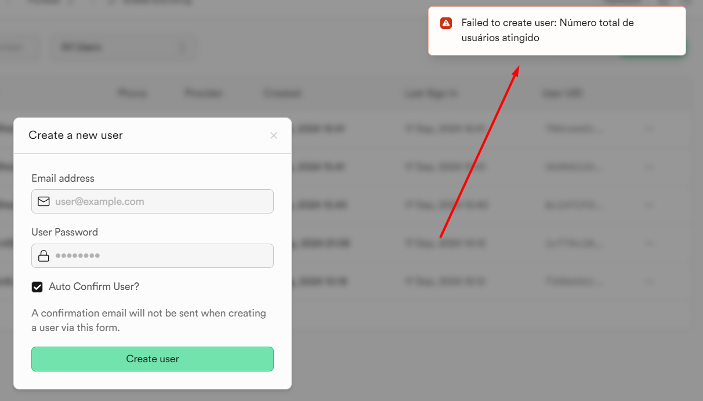

# Projeto de exemplo para `SUPABASE`

### Fontes
Para pesquisas mais aprofundadas:

* [Supabase](https://supabase.com/)
* [Client libs](https://supabase.com/docs/guides/api/rest/client-libs)
* [JS lib](https://supabase.com/docs/reference/javascript/start)

## Aplicação funcionando

[Cadastro de Alunos e Tarefas](https://rfdouro.github.io/demofrontsupabase/)

## Dados de teste

* Usuário:
  * teste@teste.com
* Senha:
  * 123456

Esse usuário apenas faz leitura e alterações. Existem **regras** (*policies*) no serviço `SUPABASE` implementadas que dão autorização apenas para um outro usuário fazer a inserção ou exclusão dos dados.


# Para usuários avançados usando API REST

* Para efetuar o login veja a [documentação](https://supabase.com/docs/reference/self-hosting-auth/refreshes-a-users-refresh-token)
  * POST
  * https://<PROJETO>.supabase.co/auth/v1/token?grant_type=password
  * Body:
    * {"email": <email>, "password": <password>}
    * Exemplo de autenticação
    * 
* Consulte a documentação de [REST](https://supabase.com/docs/guides/api)
  * Para fazer acesso pelo endpoint 
    * https://<PROJETO>.supabase.co/rest/v1/<TABELA>?
    * Exemplo de inserção de dados (observe que tem Bearer enviando o token obtido com a autenticação)
    * 
    * Exemplo de seleção de dados
    * 


# Total de usuários

Para travar o total de usuários foi criada uma trigger direto no banco de dados usando o script:

````
--select count(*) from auth.users u ;

drop trigger if exists insere_usuario_check on auth.users;
drop function if exists auth.checa_total_users;

CREATE FUNCTION auth.checa_total_users()
  RETURNS trigger AS
$func$
BEGIN
   IF (select count(*) from auth.users u) >= 5 THEN
      RAISE EXCEPTION 'Número total de usuários atingido';
   END IF;
   RETURN NEW;
END
$func$  LANGUAGE plpgsql;


CREATE TRIGGER insere_usuario_check
BEFORE INSERT ON auth.users 
FOR EACH ROW EXECUTE PROCEDURE auth.checa_total_users();
````

Diante disso o número total de usuários possível é 5. Caso tente inserir é gerado um erro no banco


